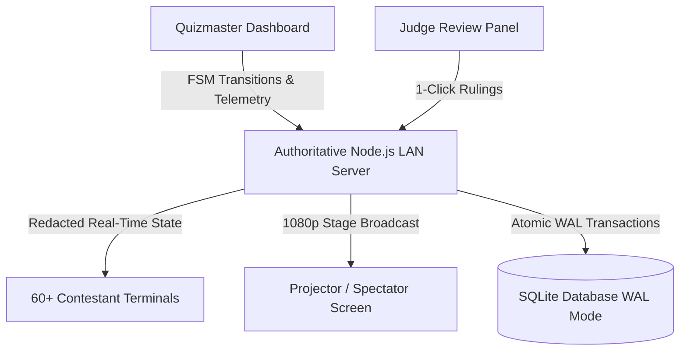

<div align="center">

  

  # 🏆 Fatima QuizBee Engine
  ### *Authoritative, Offline-First LAN Competition Management System*

  <p align="center">
    <b>College of Computer Studies • Our Lady of Fatima University (OLFU)</b><br/>
    <i>Course Project: ITPM 311 (IT Project Management)</i>
  </p>

  <p align="center">
    <a href="#-quick-start"></a>
    <a href="#-architecture"></a>
    <a href="#-architecture"></a>
    <a href="#-zero-cdn-offline-first-philosophy"></a>
    <a href="#-empirical-test-suite"></a>
    <a href="#-license"></a>
  </p>

  <p align="center">
    <a href="#-key-features">Features</a> •
    <a href="#-system-interfaces">Interfaces</a> •
    <a href="#-state-machine-lifecycle">Game Lifecycle</a> •
    <a href="#-anti-cheating--integrity">Anti-Cheat</a> •
    <a href="#-quick-start">Quick Start</a> •
    <a href="#-testing--verification">Verification</a> •
    <a href="#-documentation">Docs</a>
  </p>

  ---
</div>

## 📖 Executive Summary

The **Fatima QuizBee Engine** is an enterprise-grade, offline-first Local Area Network (LAN) tournament platform engineered specifically for collegiate computer science competitions in university lab environments. Built to eliminate cloud latency, single-point-of-failure internet dropouts, and multi-screen desynchronization, the system runs autonomously on a single host machine, coordinating **60+ simultaneous workstations** across four real-time responsive interfaces with sub-millisecond precision.

---

## ✨ Key Architectural Highlights



* **⚡ Offline-First Zero-CDN Design**: Operates entirely air-gapped with zero remote stylesheet, script, font, or audio asset dependencies. Self-contained local bundles guarantee 100% operational readiness in isolated computer labs.
* **⏱️ NTP-Lite Clock Synchronization (±1ms)**: Server timestamps govern all countdowns, submission cutoffs, and millisecond tie-breaker calculations to neutralize workstation clock skew.
* **🛡️ Authoritative State Machine (FSM)**: Strict phase gating (`LOBBY` &rarr; `READING` &rarr; `COUNTDOWN` &rarr; `PAUSED` &rarr; `LOCKED` &rarr; `REVEAL` &rarr; `LEADERBOARD`) completely prohibits out-of-phase answers or answer tampering.
* **🔊 Procedural Web Audio API Synthesizer**: 100% procedural synthesized audio chimes (ticks, warnings, timeout buzzer, phase fanfare, evaluation chimes) generated on-the-fly without external audio files.
* **📊 60-Station Live Telemetry Matrix**: Real-time heartbeat tracking, connection state, ping latency, and immediate cheating incident alerts dispatched to the Quizmaster.
* **🧑‍⚖️ Human-in-the-Loop Judge Dispute Queue**: Automatic exact and synonym scoring for Identification questions, with variations smoothly routed to faculty judges for 1-click approvals.

---

## 🖥️ System Interfaces

| Interface | URL Path | Primary Audience | Core Capabilities |
| :--- | :--- | :--- | :--- |
| **Landing Hub** | `/` | All Attendees | Central router linking to all 4 system roles with active network status. |
| **Quizmaster Dashboard** | `/quizmaster` | Quizmaster & Host | Stage question, countdown controls (pause/resume/force-lock), reveal, 60-station telemetry grid, manual score overrides, question bank CSV upload. |
| **Contestant Terminal** | `/contestant` | Competitors (1–60) | PIN workstation login (1001–1060), locked reading screen, MCQ option selector, Identification text input, neutral countdown feedback, dynamic reveal border feedback. |
| **Stage Projector** | `/projector` | Audience & Judges | High-visibility 1080p stage display, animated timer, staged question flash, dramatic answer reveal, dynamic podium leaderboard. |
| **Judge Panel** | `/judge` | Faculty Tabulators | Real-time queue for disputed identification answers with acceptable synonyms comparison and 1-click accept/reject actions. |

---

## 🔄 State Machine & Evaluation Lifecycle

```
  ┌─────────┐       Stage        ┌───────────┐       Timer Start       ┌─────────────┐
  │  LOBBY  │ ─────────────────> │  READING  │ ──────────────────────> │  COUNTDOWN  │
  └─────────┘                    └───────────┘                         └─────────────┘
       ▲                                                                      │
       │                                                                      │ Time Expires /
       │ Advance / Reset                                                      │ Force Lock
       │                                                                      ▼
  ┌─────────────┐       Reveal       ┌───────────┐      Dispute / Auto ┌─────────────┐
  │ LEADERBOARD │ <───────────────── │  REVEAL   │ <────────────────── │   LOCKED    │
  └─────────────┘                    └───────────┘                     └─────────────┘
```

1. **Reading Phase**: The question and optional syntax-highlighted code snippet are displayed on the stage projector and terminals. Inputs remain strictly locked so contestants listen to the Quizmaster.
2. **Countdown Phase**: Inputs unlock. Contestants select an option or type their answer.
   * *Neutral Feedback*: Contestant selections receive a neutral status acknowledgment (`✓ Answer Recorded • Awaiting Quizmaster reveal`). Correctness borders and sounds are deferred to prevent answer leaking.
3. **Lock Phase**: When the timer reaches 0s or is manually locked, inputs freeze instantly with a 300ms LAN network grace window.
4. **Reveal Phase**: The official answer is flashed onto the stage projector. Contestant screens dynamically update:
   * **Correct Answer**: Container flashes green (`.status-correct`), option highlighted green (`.is-correct`), points added to total score, and victory chime plays.
   * **Incorrect Answer**: Container flashes red (`.status-incorrect`), contestant choice highlighted red (`.is-incorrect`), official answer highlighted green, and incorrect tone plays.
5. **Leaderboard Phase**: Real-time calculated rankings featuring Top-3 Olympic podium animations and comprehensive roster scores.

---

## 🛡️ Anti-Cheating & Integrity Protections

* **🔒 Fullscreen Enforcement**: Terminals enforce browser fullscreen upon login; exiting fullscreen triggers a warning modal and dispatches a high-priority incident alert to the Quizmaster telemetry feed.
* **👁️ Window Blur & Tab-Switch Interception**: Detects `window.blur` and `document.visibilitychange` events, throttled by a 1.5-second debouncer to prevent telemetry flooding while maintaining a tamper-evident audit trail in SQLite `CHEAT_LOGS`.
* **🚫 Shortcut & DevTools Lockdown**: Blocks `F12`, `Ctrl+Shift+I/J/C`, `Ctrl+U`, `Ctrl+R`, `F5`, right-click context menus, and copy/paste shortcuts outside input elements.
* **🔄 Seamless Workstation Reconnection**: If a computer reboots, refreshes, or loses Wi-Fi connection, re-entering the assigned 4-digit PIN immediately re-attaches the contestant to their active session, retaining all scores and submission states.
* **🚷 Duplicate Session Eviction**: Logging in with an active PIN from another machine forcefully terminates and evicts the older socket session (`contestant:kicked`), preventing proxy submissions.
* **🎭 Server-Side Answer Redaction**: Network state broadcasts strip all `correct_answer` fields and synonym variations until the authoritative `REVEAL` phase.

---

## 🚀 Quick Start Guide

### Prerequisites
* **Node.js**: `v20.0.0` or higher
* **npm**: `v9.0.0` or higher
* Standard Local Area Network (LAN) router or lab Ethernet switch

### 1. Installation
```bash
# Clone the repository
git clone https://github.com/jevvii/ccs-quizbee-system.git
cd ccs-quizbee-system

# Install dependencies
npm install
```

### 2. Database Migration & Workstation Seeding
```bash
# Initializes SQLite in WAL mode and seeds 60 workstations (PIN 1001–1060)
npm run seed
```

### 3. Launch the Server
```bash
# Production server
npm start

# Or development mode with auto-reload
npm run dev
```

Upon launching, the engine automatically resolves the host machine's LAN IP:
```
========================================================================
   OLFU IT OLYMPICS LAN QUIZ BEE MANAGEMENT SYSTEM (ITPM 311)          
   "Fatima QuizBee Engine" — Authoritative Offline LAN Gateway          
========================================================================
 LAN Host IP:        192.168.1.100
 Binding Address:    0.0.0.0:3000
 Database:           quizbee.db (SQLite WAL Mode)
 Workstation Range:  Terminals 1–60 (PIN 1001–1060)
------------------------------------------------------------------------
 Role Interface URLs:
   • Landing Hub:        http://192.168.1.100:3000/
   • Quizmaster:         http://192.168.1.100:3000/quizmaster
   • Contestant PCs:     http://192.168.1.100:3000/contestant
   • Stage Projector:    http://192.168.1.100:3000/projector
   • Judge Panel:        http://192.168.1.100:3000/judge
========================================================================
```

---

## 📥 Question Bank CSV Importer

The Quizmaster dashboard includes an administrative CSV uploader with replace or append modes, downloadable templates, and real-time validation:

```csv
round,type,question,code_snippet,option_a,option_b,option_c,option_d,correct_answer,acceptable_synonyms,points,timer_seconds
Easy,MCQ,"What does HTML stand for?","",Hyper Text Markup Language,High Tech Machine Language,Hyper Tool Multi Language,None,A,"",1,15
Average,IDENTIFICATION,"Which protocol operates on port 443?","","","","","",HTTPS,"Hypertext Transfer Protocol Secure;SSL",2,30
Difficult,MCQ,"What is the output of this snippet?","console.log(typeof NaN);",number,undefined,object,NaN,A,"",3,45
Clincher,IDENTIFICATION,"Name the design pattern that restricts instantiation of a class to a single instance.","","","","","",Singleton,"Singleton Pattern",5,30
```

---

## 🧪 Testing & Verification

The system includes an exhaustive multi-tier verification suite covering unit, integration, boundary, adversarial, and high-concurrency simulation scenarios.

```bash
# Run complete test suite (175 tests)
npm test

# Run 35+ concurrent headless contestant socket simulation
node --test tests/simulation.test.js

# Run frontend UI contract and DOM selector integrity test
node --test tests/challenge_m3_ui.test.js

# Run procedural Web Audio API and client controller stress tests
node --test tests/challenger_m3_stress.test.js

# Run comprehensive master test runner
node tests/runAllTests.js
```

### Verification Highlights
* **100% Pass Rate**: 175/175 tests consistently passing across all modules.
* **Concurrency Resilience**: 60 concurrent submissions in a 100ms burst achieve clean recording with zero `SQLITE_BUSY` errors.
* **Tamper Immunity**: Late submissions (>300ms post-deadline) and non-countdown phase submissions are rejected with zero score inflation.

---

## 📂 Project Structure

```
ccs-quizbee-system/
├── docs/                                 # ITPM 311 Coursework Documentation
│   ├── ITPM311_PROJECT_PLAN.md           # Project Charter, WBS, Risk Matrix & Timeline
│   ├── SYSTEM_ARCHITECTURE_AND_SPECS.md  # System Architecture & Socket Protocol Specifications
│   ├── LAN_DEPLOYMENT_RUNBOOK.md         # Computer Lab Network Deployment & Troubleshooting Guide
│   └── VERIFICATION_AND_AUDIT_REPORT.md  # Empirical Verification & Security Audit Report
├── public/                               # Offline Zero-CDN Frontend
│   ├── css/                              # Minimalist, modern dark/light responsive stylesheets
│   ├── js/                               # Client controllers & procedural audio synth
│   │   ├── audio.js                      # Web Audio API procedural sound synthesizer
│   │   ├── contestant.js                 # Workstation controller, anti-cheat & reveal feedback
│   │   ├── judge.js                      # Dispute queue & 1-click ruling handlers
│   │   ├── projector.js                  # 1080p stage display & podium animations
│   │   └── quizmaster.js                 # Game master dashboard & telemetry grid
│   ├── logo/                             # Official College of Computer Studies brand assets
│   ├── contestant.html                   # Contestant terminal workstation view
│   ├── index.html                        # Central landing hub
│   ├── judge.html                        # Judge evaluation panel
│   ├── projector.html                    # Stage projector spectator view
│   └── quizmaster.html                   # Quizmaster control panel
├── src/                                  # Backend Engine
│   ├── config.js                         # Network auto-discovery & timing configuration
│   ├── csvImporter.js                    # Robust CSV parser for question bank uploads
│   ├── db.js                             # SQLite WAL persistence layer with prepared statements
│   ├── gameEngine.js                     # Authoritative 5-phase tournament state machine
│   ├── seed.js                           # Workstation PIN (1001–1060) migration seeder
│   ├── server.js                         # Express HTTP server & API endpoints
│   ├── socketHandler.js                  # Socket.io role routing, NTP-lite clock sync & auth
│   └── telemetryManager.js               # Workstation telemetry tracking & incident debouncing
├── tests/                                # Multi-tier automated testing suite (175+ tests)
├── sample_questions.csv                  # Official sample competition question bank
├── sample_trial_questions.csv            # Dry-run trial question set (0 points)
├── package.json                          # Project dependencies and script runner
└── README.md                             # Project documentation
```

---

## 📚 ITPM 311 Project Artifacts

Comprehensive documentation submitted for the **ITPM 311 (IT Project Management)** course:
* [📋 ITPM 311 Project Plan & Charter](docs/ITPM311_PROJECT_PLAN.md)
* [🏛️ System Architecture & Specifications](docs/SYSTEM_ARCHITECTURE_AND_SPECS.md)
* [🔌 LAN Deployment & Network Runbook](docs/LAN_DEPLOYMENT_RUNBOOK.md)
* [🔍 Empirical Verification & QA Audit Report](docs/VERIFICATION_AND_AUDIT_REPORT.md)

---

## 👥 Project Team & Credits

* **Institution**: [Our Lady of Fatima University (OLFU)](https://www.fatima.edu.ph/)
* **Department**: College of Computer Studies (CCS)
* **Event**: Fatima IT Olympics — Inter-Campus Quiz Bee Championship
* **Lead Developer / PM**: [Jevvii Marcelo](https://github.com/jevvii) (`@jevvii`)
* **Contributors**:
  * [John Kyle Caampued](https://github.com/jscaampued5745val) (`@jscaampued5745val`)

---

## 📄 License

This project is licensed under the **MIT License** — see the [LICENSE](LICENSE) file for details.
