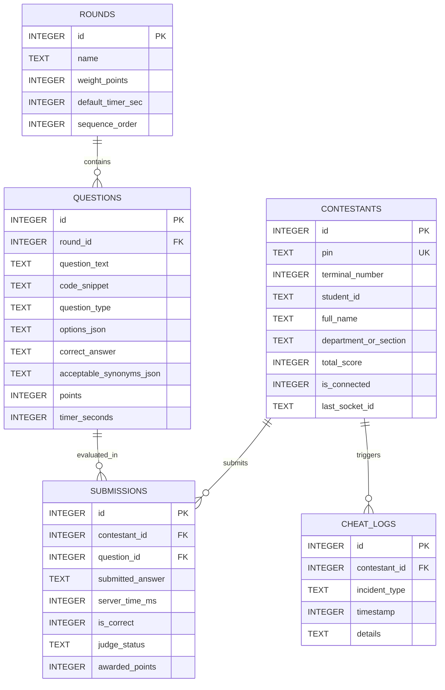

# OLFU IT Olympics Quiz Bee — System Architecture & Technical Specifications
## Fatima QuizBee Engine (ITPM 311 Coursework)

---

## 1. System Overview & Offline-First Boundary

The **Fatima QuizBee Engine** is an authoritative, offline-first Local Area Network (LAN) tournament platform developed for the College of Computer Studies at Our Lady of Fatima University (OLFU). It is purpose-built to operate in university computer laboratory environments with zero external internet dependencies, zero cloud database connections, and zero third-party CDN asset delivery.

```
+-----------------------------------------------------------------------------------+
|                            OFFLINE LAN BOUNDARY (0.0.0.0:3000)                    |
|                                                                                   |
|  +-----------------------------------------------------------------------------+  |
|  |                     Node.js / Express Application Server                     |  |
|  |                                                                             |  |
|  |   +-----------------------+   +-------------------+   +------------------+  |  |
|  |   |    REST API Layer     |   | Socket.io Gateway |   | Telemetry Engine |  |  |
|  |   | /api/{health,status}  |   | NTP-Lite Sync     |   | Incident Logger  |  |  |
|  |   +-----------------------+   +-------------------+   +------------------+  |  |
|  |                                         |                                   |  |
|  |                        +----------------▼---------------+                   |  |
|  |                        |  Authoritative FSM GameEngine  |                   |  |
|  |                        |  (LOBBY->READ->COUNT->LOCK...) |                   |  |
|  |                        +----------------┬---------------+                   |  |
|  |                                         |                                   |  |
|  |                        +----------------▼---------------+                   |  |
|  |                        |   SQLite 3 (WAL Mode Engine)   |                   |  |
|  |                        |   Atomic Prepared Statements   |                   |  |
|  |                        +--------------------------------+                   |  |
|  +-----------------------------------------------------------------------------+  |
|                                          |                                        |
|         +-----------------+--------------+---------------+-----------------+      |
|         |                 |                              |                 |      |
|   +-----▼-----+     +-----▼-----+                  +-----▼-----+     +-----▼----+ |
|   | Quizmaster|     | Contestant|                  | Projector |     |  Judge   | |
|   | Dashboard |     | Terminals |                  | 1080p View|     |  Panel   | |
|   +-----------+     +-----------+                  +-----------+     +----------+ |
+-----------------------------------------------------------------------------------+
```

---

## 2. Finite State Machine (FSM) Lifecycle

The tournament game engine coordinates five authoritative stages per question:

```
[LOBBY] ──► stageQuestion() ──► [READING] ──► startCountdown() ──► [COUNTDOWN]
                                                                        │
                                                                   auto-expire /
                                                                   force-lock
                                                                        ▼
[NEXT QUESTION] ◄── showLeaderboard() ◄── [LEADERBOARD] ◄── revealAnswer() ◄── [LOCKED]
                                                                        │
                                                               (disputed answers)
                                                                        ▼
                                                                  [REVIEW QUEUE]
```

### Stage Details
1. **LOBBY**: Waiting state between rounds or before tournament start.
2. **READING**: Question text and code snippets are projected on the stage; contestant terminals remain locked with a listening prompt.
3. **COUNTDOWN**: Authoritative server timer ticks at 1000ms intervals; contestant terminals unlock for answering. Submissions arriving within the countdown deadline + 300ms LAN network grace window are recorded.
4. **LOCKED**: Submissions strictly rejected (`EXPIRED_LATE_SUBMISSION`). Ambiguous or non-matching Identification questions are queued to the Judge panel as `PENDING`.
5. **REVEAL**: Quizmaster triggers dramatic answer reveal on the projector; audio fanfare chimes.
6. **LEADERBOARD**: Scores calculated and broadcast to all screens with podium standings and rankings.

---

## 3. Database Schema (SQLite WAL Mode)

The system utilizes SQLite with **WAL (Write-Ahead Logging)** enabled (`PRAGMA journal_mode = WAL`) to support high-frequency concurrent socket reads and atomic transactional writes.

### Entity Relationship Diagram


---

## 4. WebSocket Real-Time Event Protocol

All communication between the server and the 4 role interfaces flows through dedicated Socket.io rooms:
* `room:quizmaster`: Administrative tournament controls, telemetry feeds, and cheat alerts.
* `room:contestants`: Question delivery, timer heartbeats, and lock broadcasts.
* `room:projector`: 1080p stage display updates and animated leaderboard broadcasts.
* `room:judges`: Identification review queue and dispute resolutions.
* `contestant:${pin}`: Private channel for individual score notifications and session re-attachment.

| Channel / Event | Direction | Role Room | Payload Description |
| :--- | :--- | :--- | :--- |
| `sync:ping` / `sync:pong` | Bidirectional | All | NTP-lite clock sync with server receipt and dispatch timestamps. |
| `contestant:auth` | Client $\rightarrow$ Server | Contestant | PIN authentication; returns restored profile, game state, and score. |
| `contestant:submit` | Client $\rightarrow$ Server | Contestant | Answer submission recorded with authoritative `server_time_ms`. |
| `contestant:incident` | Client $\rightarrow$ Server | Contestant | Fullscreen exit or window blur anti-cheat incident notification. |
| `qm:question:stage` | Client $\rightarrow$ Server | Quizmaster | Advances game to `READING` phase for selected question ID. |
| `qm:timer:start` | Client $\rightarrow$ Server | Quizmaster | Starts authoritative countdown and unlocks contestant terminals. |
| `qm:force:lock` | Client $\rightarrow$ Server | Quizmaster | Forces immediate lockdown of submissions. |
| `qm:answer:reveal` | Client $\rightarrow$ Server | Quizmaster | Broadcasts correct answer and explanation to projector. |
| `judge:dispute:action` | Client $\rightarrow$ Server | Judge | Approves or rejects pending identification answer. |
| `leaderboard:update` | Server $\rightarrow$ All | Projector/All | Recalculates and broadcasts top-10 podium standings. |

---

## 5. Security & Anti-Cheating Architecture

1. **Fullscreen Enforcement**: Contestant client requests browser fullscreen upon authentication; exiting fullscreen triggers a server-recorded `FULLSCREEN_EXIT` incident.
2. **Window Blur & Visibility Detection**: Uses `document.visibilitychange` and `window.blur` listeners; switches to secondary apps or tabs trigger `WINDOW_BLUR` and `TAB_SWITCH` telemetry alerts.
3. **Shortcut & DevTools Interception**: Keyboard listeners block `F12`, `Ctrl+Shift+I`, `Ctrl+U`, `Ctrl+C`, `Ctrl+V`, and right-click context menus.
4. **Duplicate Session Eviction**: If a second socket attempts to authenticate with an already active PIN, the previous socket is evicted with `contestant:kicked` to prevent dual-terminal cheating.
5. **Answer Redaction**: All contestant and spectator socket payloads strip `correct_answer`, `options_json` correct answers, and `synonyms` until the official reveal phase.
